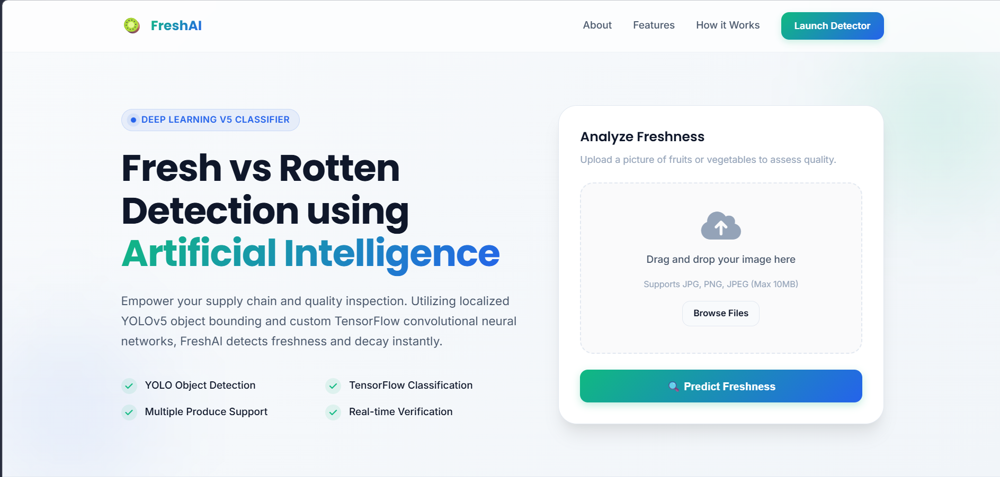
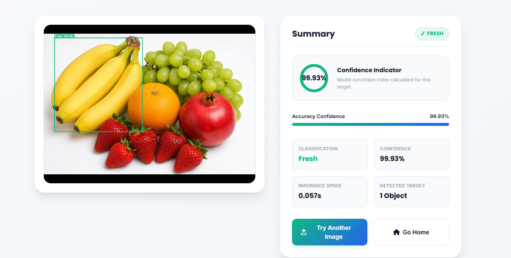
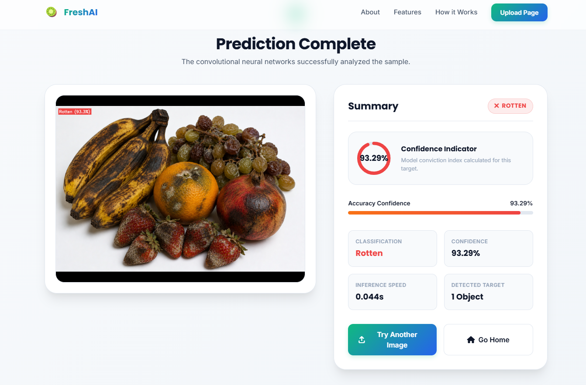

# 🥝 FreshAI — Fresh vs. Rotten Fruit & Vegetable Detection

An AI-powered computer vision and deep learning web application built with **Flask**, **PyTorch**, **TensorFlow**, and **YOLOv5**. FreshAI localizes produce in images, crops out background noise, and classifies fruits as **Fresh** or **Rotten** in real time.

---






## 🌟 Key Highlights & Features

- **🎯 YOLOv5 Localized Object Detection:** Automatically locates fruits/vegetables, crops region-of-interest bounding boxes, and eliminates background clutter (plates, tables, hands, shadows).
- **🧠 Deep Convolutional Neural Network:** Utilizes a fine-tuned MobileNetV2 architecture trained to detect texture discoloration, surface defects, and mold patterns.
- **⚡ 100% In-Memory (RAM) Processing:** Image inputs and annotated bounding-box visualizers are processed entirely in RAM and encoded as **Base64 Data URLs**. Zero disk writes or storage leaks.
- **📈 High Accuracy (96.70%):** Upgraded model pipeline achieving **96.70% overall test accuracy** and a low test loss of **0.1412**.
- **🎨 Premium UI/UX AI Dashboard:** Inspired by modern tech startups (Apple, Vercel, Linear, Stripe) with glassmorphism effects, dark/light cards, circular SVG gauges, animated statistics, and responsive layouts.
- **🌐 Decoupled REST API & CORS Ready:** Configured with `Flask-CORS` for hybrid deployment (e.g., ML API hosted on Render/Railway and Static Frontend hosted on Vercel/GitHub Pages).

---

## 📊 Model Performance & Accuracy Progression

### 📈 Why Accuracy Improved from 94.70% to 96.70%:

| Parameter | Initial Baseline | Upgraded Model | Why It Improved |
| :--- | :---: | :---: | :--- |
| **Accuracy Score** | **94.70%** | **96.70%** | **+2.00% boost in overall test classification** |
| **Object Localization** | Full Image Input | YOLOv5 Crop Isolation | Removes background noise/objects before feeding pixels to the CNN. |
| **Data Augmentation** | None (Rescale only) | Rotations, Flips, Zooms, Brightness | Forces the network to learn invariant surface features rather than orientation. |
| **Model Regularization** | None | Dropout (0.4) Layer | Prevents neuron co-adaptation and stops overfitting. |
| **Transfer Learning** | 100% Frozen Layers | Two-Stage Fine-Tuning | Unfreezing top 30 MobileNetV2 layers allows adaptation to fruit textures. |

---

### 📋 Detailed Test Dataset Evaluation Report

Evaluation computed on test dataset split (`212 test images`):

```
=======================================================
 EVALUATION METRICS REPORT
=======================================================

Overall Test Accuracy : 96.70%
Test Loss             : 0.1412

Classification Report:
-------------------------------------------------------
              precision    recall  f1-score   support

       Fresh     0.9630    0.9717    0.9673       106
      Rotten     0.9712    0.9623    0.9667       106

    accuracy                         0.9670       212
   macro avg     0.9671    0.9670    0.9670       212
weighted avg     0.9671    0.9670    0.9670       212

Confusion Matrix:
-------------------------------------------------------
Classes: ['Fresh', 'Rotten']
[[103   3]
 [  4 102]]

- True Negatives (Fresh)                     : 103 / 106 (97.17%)
- False Positives (Misclassified as Rotten)   : 3 / 106  (2.83%)
- False Negatives (Misclassified as Fresh)    : 4 / 106  (3.77%)
- True Positives (Rotten)                    : 102 / 106 (96.23%)
=======================================================
```

---

## 🔄 How It Works (Step-by-Step Architecture)

```
┌─────────────────┐       ┌─────────────────┐       ┌─────────────────┐       ┌─────────────────┐
│ 1. User Upload  │  ───> │ 2. YOLOv5 Crop  │  ───> │ 3. CNN Predict  │  ───> │ 4. UI Dashboard │
│ Drag & drop image│       │ Localizes fruit │       │ Classifies Fresh│       │ Renders gauges  │
│ into web card.  │       │ & extracts crop.│       │ versus Rotten.  │       │ & annotated box.│
└─────────────────┘       └─────────────────┘       └─────────────────┘       └─────────────────┘
```

1. **Client Upload:** User drops a fruit/vegetable image into the web dashboard.
2. **RAM Stream:** Flask reads the file bytes into a memory buffer (`np.frombuffer`).
3. **YOLOv5 Localizer:** PyTorch YOLOv5 detects fruit coordinates and crops out background objects.
4. **CNN Classifier:** The cropped fruit region is normalized and fed into the trained Keras model (`healthy_vs_rotten.h5`).
5. **OpenCV Bounding Box:** Bounding boxes (Emerald Green for Fresh, Red for Rotten) and confidence labels are drawn over the image in RAM.
6. **Base64 Encoding:** The annotated image is converted into a Base64 Data URL string and sent back to the frontend dashboard.

---

## 🛠️ Tools, Technologies & Libraries Used

### 1. Machine Learning & Computer Vision
- **PyTorch (`torch`):** Loads YOLOv5 object detection weights (`yolov5s.pt`) for localization.
- **TensorFlow / Keras (`tensorflow`):** Executes CNN classification model (`healthy_vs_rotten.h5`) built on MobileNetV2.
- **OpenCV (`opencv-python-headless`):** Handles memory image decoding, fruit cropping, resizing, and drawing bounding boxes.
- **Scikit-Learn (`scikit-learn`):** Generates classification reports, confusion matrices, F1-scores, precision, and recall.
- **NumPy (`numpy`):** Array transformations, normalization, and memory buffer management.

### 2. Backend & Deployment
- **Flask (`flask`):** Python web framework handling HTTP routes, request parsing, and template rendering.
- **Flask-CORS (`flask-cors`):** Enables Cross-Origin requests for decoupled API deployments.
- **Gunicorn (`gunicorn`):** Production WSGI HTTP web server.
- **Docker:** Containerized environment configuration (`Dockerfile`).

### 3. Frontend & User Interface
- **HTML5 & CSS3:** Responsive UI built with custom CSS variables, flexbox, grid layouts, and glassmorphism.
- **Vanilla JavaScript (ES6+):** Drag-and-drop file API, local image previews, regex string parsing, counter animations, and SVG gauge controls.
- **FontAwesome & Google Fonts:** Vector icons with **Inter** and **Poppins** modern typography.
